# ShaderPT: A GLSL Port for SmallPT

---

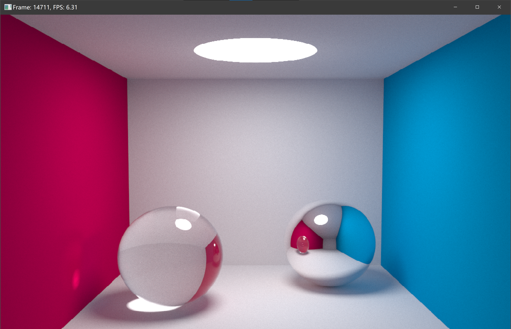

Sorry, most of the content of this document is currently only available in Chinese. Please feel free to use a translator if you want to read them.

Welcome to convert the following code to GLSL, i.e. to implement “sampled lights”, including “sampled spheres by solid angle” and “shadow rays.”

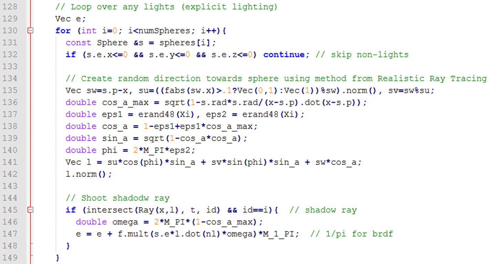

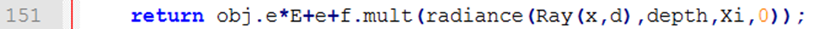

## 一、实现功能

- [x] 实现光线跟踪算法；
- [x] 通过底层算法实现计算光线交点来绘制场景；
- [x] 场景中图元数量不少于 5 个：共 9 个，分别为左墙、右墙、天花板、地板、不锈钢球、玻璃球、顶灯；
- [x] 能够实现自然软阴影效果；
- [x] 能够实现一个不锈钢表面材质物体反射周围环境的基本效果。

## 二、实现亮点

- 不依赖除 OpenGL 外的任何第三方库，调用操作系统 API 创建窗口实时预览渲染过程；
- 使用 OpenGL 4.5 的新版特性，包括计算着色器、可编程流水线，并默认使用独立显卡进行加速，充分利用显卡性能，占用率可达 100%（NVIDIA GTX 1650 和 Intel UHD 630）；
- 光追计算着色器代码中逐行撰写了注释，在保证可读性的情况下精简代码，力争用最短的代码（C 程序 + 着色器程序）实现能力范围内最好的效果。

## 三、运行/开发环境

- 运行 `./main`，如果控制台输入类似以下信息，并弹出窗口可看到渲染内容，则运行成功。

  ```shell
  GL_VERSION: 4.6.0 NVIDIA 526.98
  GL_VENDOR: NVIDIA Corporation
  GL_SHADING_LANGUAGE_VERSION: 4.60 NVIDIA
  ```

- 由于使用 Win32 API 创建窗口，故只能在 Windows 上运行。开发环境为 Windows 10 21H2 19044.2364。

- OpenGL 版本必须不低于 4.5。

- 编译代码有两种方式：

  1. 安装了 Visual Studio：“开始”菜单中打开“Developer PowerShell for VS 2022”或“Developer Command Prompt for VS 2022”，`cd` 到代码当前目录，然后输入`./build` 即可编译运行。
  2. 安装了 CMake 和兼容的编译器（MSVC 或 MinGW）：按照使用 CMake 的习惯编译，或使用支持 CMake 的 IDE（如 Visual Studio 或 CLion）作为项目打开文件夹。

## 四、实现原理概览（详情课件代码注释）

1. 模拟光照

   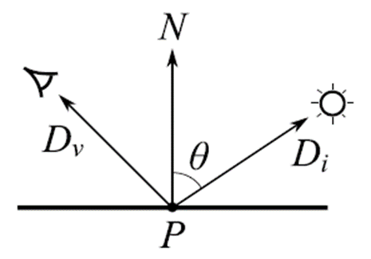

   渲染方程

   

   其中使用蒙特卡洛法 + “帐篷滤波器”，可以得到更平滑的图片。

   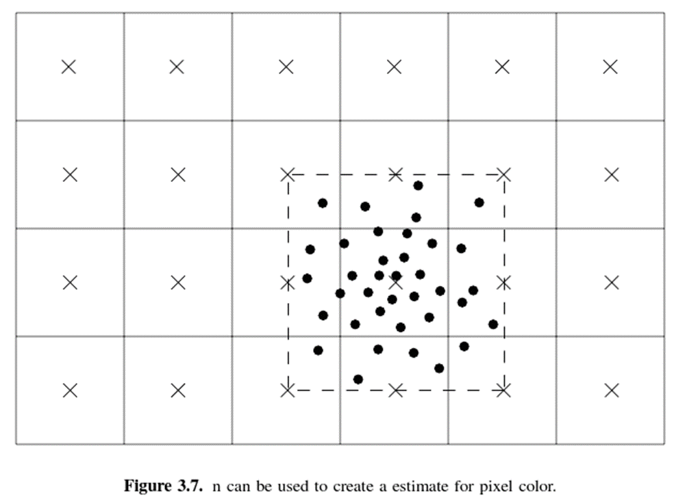

   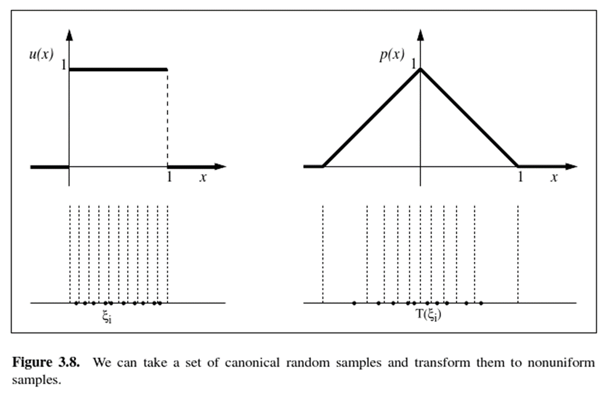

2. 算法伪代码

   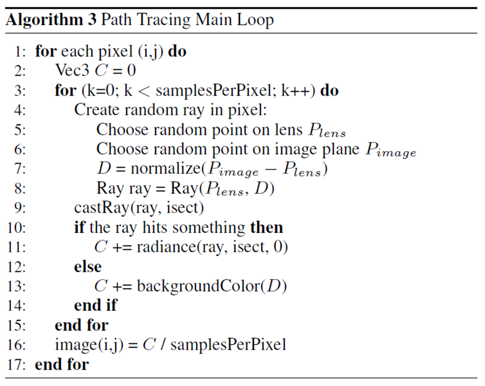

   实现过程中，将所有图元均用球体表示，墙作为半径巨大的球，可以统一光线求交的代码。

   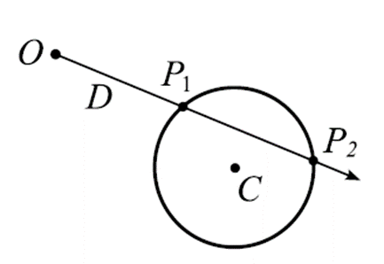

   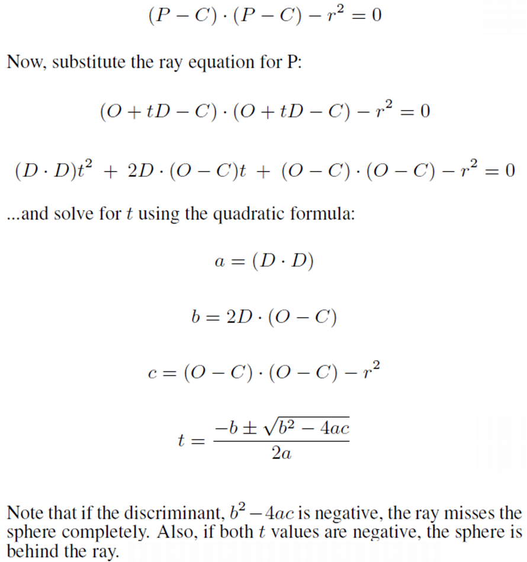

   使用了俄罗斯轮盘赌，随机停止继续追踪光线。

   ```glsl
   vec3 random = rand(uvec3(coord, frameIndex * 64 + depth));
   float p = max(max(nearestObject.color.x, nearestObject.color.y), nearestObject.color.z);  // max reflectance color
   if (depth > RUSSIAN_ROULETTE_THRESH) {
       if (random.z >= p) {
       	break;
       }
       else {
       	accmat /= p;  // scale accumulated material by reflectance
       }
   }
   ```

   分反射、散射、折射生成不同光线，并考虑全反射。

   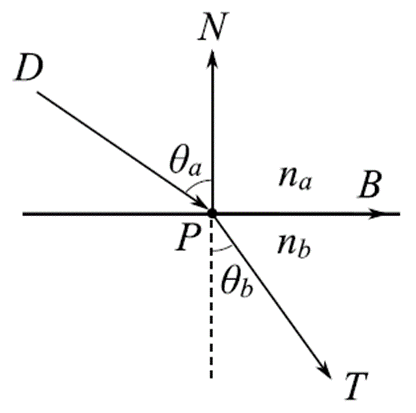

   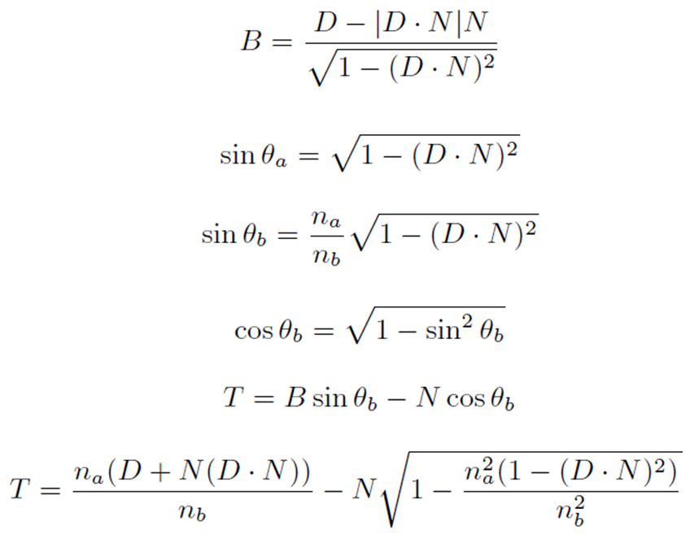

   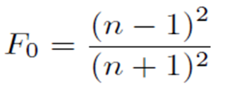

   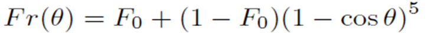

3. 主程序：`main.c`，负责创建窗口、准备场景、准备缓冲区、编译链接着色器代码、切换缓冲区显示每一帧。

4. 计算着色器：`compute.glsl`，负责实现算法流程，以 $16 \times 16$ 为单位分批计算，将颜色保存在纹理缓冲区。

5. 顶点着色器：`vertex.glsl`  ，实际上就是屏幕的矩形，用来显示渲染的图像。

6. 片元着色器：`fragment.glsl`，负责将生成的图像作为纹理映射到屏幕矩形上，对图像应用了伽玛矫正，让颜色看起来更自然。

7. 其余文件：加载 OpenGL 函数指针的必要库文件。

## 五、实现感悟

通过本次实验，学习了光线追踪算法，熟悉了 OpenGL 的使用，真正感受到了 GPU 加速的特点。该算法有纯 CPU 实现的版本，即使使用了 OpenMP 多核并行加速，相比这个用着色器实现的版本，还是要慢很多。通过对比，我也更深刻地理解了 CPU 程序和着色器程序之间的关系。但着色器代码不能像 CPU 代码那样打断点调试，且 OpenGL 准备过程复杂，如必须按顺序绑定各种缓冲区，否则只有一片黑，让我倍受折磨。这也让我感受到了抽象封装成通用框架的重要性，如把编译链接着色器代码、按顺序绑定各种缓冲区的流程都抽象封装成通用框架，这样后续使用时能方便许多。总之，图形学真的很有意思！

## 六、参考文献

`Kevin Beason, smallpt - A Monte Carlo Path Tracer.`

[imgeself/raytracer: Ray tracer for my own learning purposes (github.com)](https://github.com/imgeself/raytracer)
